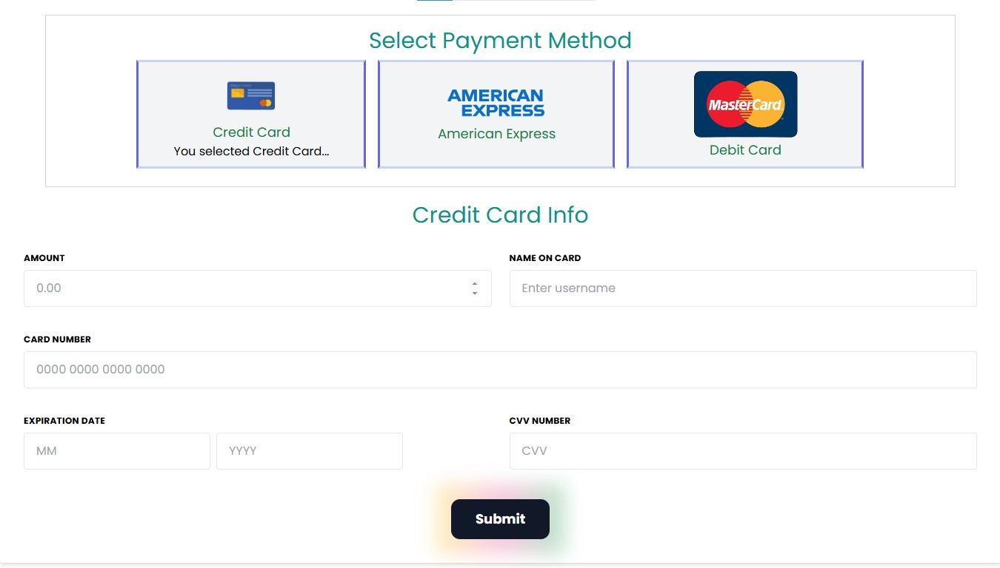

# ☕ BrewBuddy: Your Ultimate Coffee Ordering Experience


## 🌟 Features

- **📱 Persistent Shopping Cart:** Never lose your selections when browsing different pages
- **🛍️ Multi-Page Menu:** Browse our extensive coffee selection across multiple pages
- **💳 Secure Checkout:** Easy and secure payment processing
- **📱 Responsive Design:** Perfect experience on any device
- **🎯 Real-Time Updates:** Instant cart and total price updates
- **✨ Modern UI:** Clean, intuitive interface with Tailwind CSS

## 🛠️ Technologies

- **Frontend:**
  - HTML5
  - CSS3 with Tailwind CSS for modern styling
  - Vanilla JavaScript for dynamic functionality
  - LocalStorage for cart state management

- **UI Framework:**
  - Tailwind CSS for responsive design
  - Custom CSS for additional styling

## 🚀 Getting Started

### Prerequisites

- Any modern web browser (Chrome, Firefox, Safari, Edge)
- Basic understanding of web development
- Git for version control

### Installation

1. Clone the repository:
   ```bash
   git clone https://github.com/saeedhalabi/BrewBuddy.git
   cd BrewBuddy
   ```

2. Open in your preferred code editor:
   ```bash
   code .
   ```

3. Install the recommended extensions:
   - Tailwind CSS IntelliSense
   - Live Server (optional)

4. Start exploring the project:
   - Open `index.html` in your browser
   - Or use Live Server for auto-reload functionality

## 📂 Project Structure

```
BrewBuddy/
│
├── client/
│   ├── app.js          # Main page functionality
│   ├── cart.js         # Cart state management
│   ├── page2.js        # Second page functionality
│   ├── page3.js        # Third page functionality
│   ├── index.html      # Main page
│   ├── page2.html      # Additional menu items
│   ├── page3.html      # More coffee options
│   ├── style.css       # Global styles
│   ├── validation.css  # Form validation styles
│   └── images/         # Product images
│
├── screenshots/        # Project screenshots
└── README.md          # Project documentation
```

## 📸 Screenshots

<div align="center">
  
  
</div>

## 🗝️ Key Features Explained

### Cart System
- Persistent cart state across pages using localStorage
- Real-time price updates
- Easy quantity management
- Smooth checkout process

### User Interface
- Responsive design for all screen sizes
- Intuitive navigation
- Clear product presentation
- Easy-to-use cart management

## 🤝 Contributing

Contributions are welcome! Feel free to submit pull requests or open issues.


---
<div align="center">
  Made with ☕ and 💖 by Saeed Halabi
</div>
