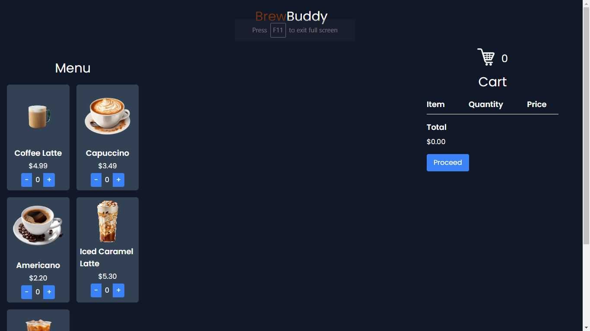

# BrewBuddy: Your Companion for Coffee Delights



## Description

BrewBuddy is your go-to app for exploring a variety of coffee options and managing your orders with ease. Whether you're a coffee aficionado or just looking for your daily caffeine fix, BrewBuddy has got you covered. Browse through our selection of delicious beverages, add them to your cart, and proceed to checkout hassle-free. With BrewBuddy, your coffee cravings are just a click away.

## Features

- **Interactive Menu:** Explore a diverse range of coffee options and select your favorites.
- **Easy Ordering:** Add items to your cart and proceed to checkout seamlessly.
- **Real-Time Updates:** Stay informed about your order status with instant notifications.
- **Responsive Design:** Enjoy a smooth browsing experience across all devices.

## Technologies Used

- **HTML5**
- **CSS3**
- **JavaScript**
- **Tailwind CSS**

## Application of Choice

### VS-Code

The entire application was developed using Visual Studio Code, a versatile source code editor known for its lightweight design and robust features.

## Useful Extensions

1. **Live Server**
   - **Extension:** [Tailwind CSS IntelliSense](https://marketplace.visualstudio.com/items?itemName=bradlc.vscode-tailwindcss)
   - **Description:** Tailwind CSS IntelliSense is an extension for Visual Studio Code that enhances your development workflow by providing intelligent suggestions and autocompletions for Tailwind CSS classes directly within your HTML and CSS files. With Tailwind CSS IntelliSense, you can speed up your styling process, reduce typos, and ensure consistent usage of Tailwind utility classes. This extension leverages the power of Tailwind CSS's utility-first approach to offer context-aware suggestions, making it easier for you to create responsive and visually appealing designs.
## Setup

### Cloning the Repository

1. Clone the repository to your local machine:
   ```bash
   git clone https://github.com/yourusername/BrewBuddy.git

## Running The Project Locally
1. Open the project folder in VSCode.
2. Install Tailwind CSS IntelliSense extension.
3. Setup configuration from VSCode settings.
4. Start exploring the BrewBuddy app and enjoy your coffee journey!

## Learnings
Throughout the development of BrewBuddy, I gained valuable insights and skills in:

- Building responsive web applications using HTML, CSS, Tailwind CSS, and JavaScript.
- Implementing dynamic functionalities to enhance user experience.
- Integrating Tailwind CSS for efficient styling and layout.

## Challenges Faced
- Designing a user-friendly interface that caters to diverse coffee preferences.

- Implementing real-time updates for order tracking and status notifications.

Despite these challenges, each obstacle provided an opportunity for growth, skill development, and a deeper understanding of web development principles.

## Disclaimer
BrewBuddy is designed to provide a convenient and enjoyable coffee ordering experience. Please feel free to explore my app and indulge in your favorite brews responsibly.